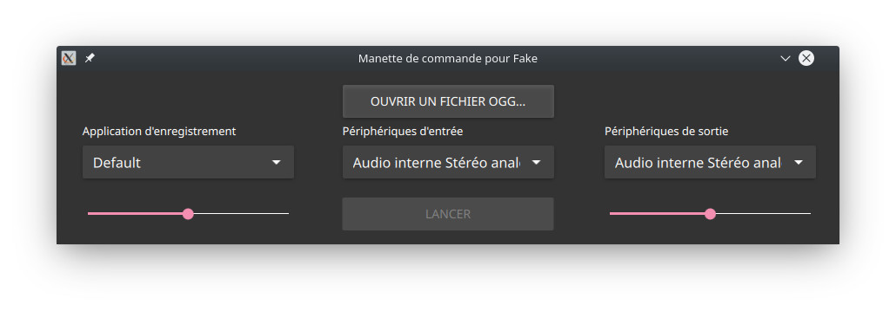
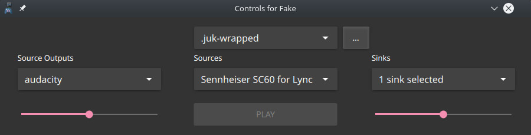

# Controls for Fake Microphone Wav Player


This is the Gui frontend for the Fake Microphone Wav Player [https://github.com/SCOTT-HAMILTON/FakeMicWavPlayer](https://github.com/SCOTT-HAMILTON/FakeMicWavPlayer)


# Meson Building 
  To build it, run : 
  ```sh
  meson setup build
  ninja -C build
  ninja -C install
  ```

## Screenshots
Here are a few screenshots of the app.

 > The app right when launched



 > The app when all fields are entered
 


	

# Requirements
 - FakeLib (provided by [https://github.com/SCOTT-HAMILTON/FakeMicWavPlayer](http://))
 - Qt 5.14 (The QML code could be adapted to support all Qt 5 )
 - QtQuick2

License
----
Fake is delivered as it is under the well known MIT License

# Todo - work in progress

 * Translations (french only, I don't speak that much languages, help is welcomed)
 * Meson qt5 module is obscure, I didn't find anyway of telling meson to compile the 
 translation files before preprocessing the ressource files. This is why I keep those
 ugly precompiled qm files 🤮. If you know how to fix this, please tell me.


[//]: # (These are reference links used in the body of this note and get stripped out when the markdown processor does its job. There is no need to format nicely because it shouldn't be seen. Thanks SO - http://stackoverflow.com/questions/4823468/store-comments-in-markdown-syntax)
   [meson manual]: <https://mesonbuild.com/Manual.html>
