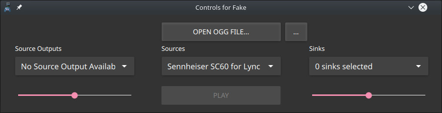

# ControlsForFake
The Qt gui frontend for FakeMicWavPlayer.

## Screenshots
Here are a few screenshots of the app.

 > The app right when launched



 > The app when all fields are entered
 


# Requirements
 - FakeLib (provided by [https://github.com/SCOTT-HAMILTON/FakeMicWavPlayer](http://))
 - Qt 5.14 (The QML code could be adapted to support all Qt 5 )
 - QtQuick2
 
# Building 
  - ```$ qmake .```
  - ```$ make```

# Usage
Just launch it and use it. I should be statically linked to libFake and shoudln't have any other dependencies than Qt
License
----
Like Fake, Control's for Fake is delivered as it is under the well known MIT License.

# Todo - work in progress

 * Translations (french only, I don't speak that much languages, any help is welcomed)
 * Better integration for building : there is still quite a lot of horror in the .pro file
